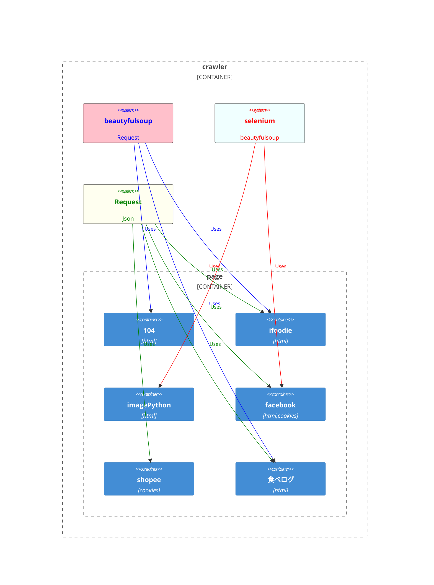
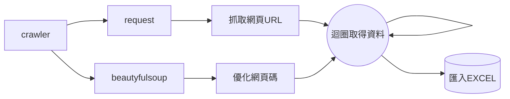
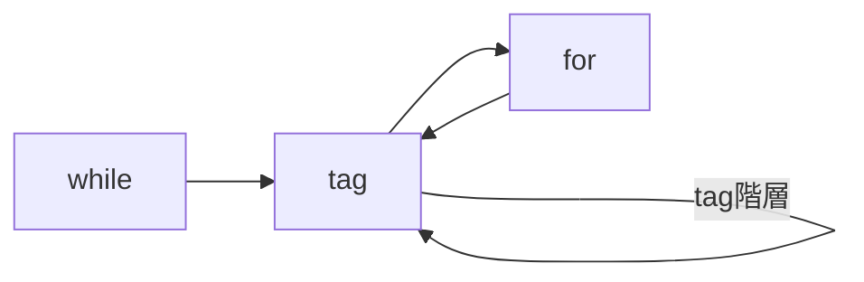
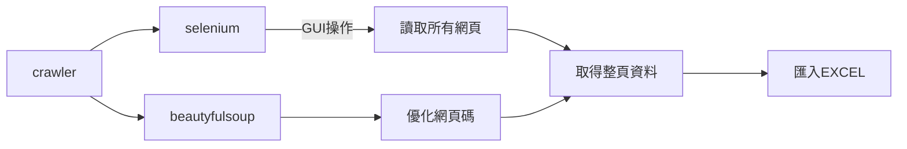
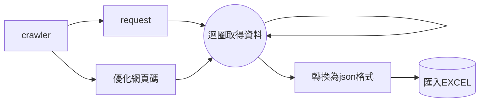

# web-crawler


## Request & beautyfulsoup

安裝模主
```
pip install requests
```
```
pip install beautifulsoup4
```

##### 取得網頁
###### 進入瀏覽器按F12，點選network並押Ctr+R，點選第一個網址，複製header中的Requests url
```
res=requests.get("URL")
```
###### 把網頁轉成PY能讀取的
```
soup=BeautifulSoup(res.text, 'html.parser')
```
###### 回圈取得多頁資料

```
page=1 
while soup.tag !=[]:   
    for data in soup.find_all("tag") :  
        print(data."想取得的資料")
    page+=1  
    res=requests.get("url"+str(page)) #覆蓋網址
    soup=BeautifulSoup(res.text, "html.parser") 

```


## selenium



##### 安裝模主

```
pip install selenium
```
```
pip install beautifulsoup4
```
##### 設定瀏覽器
```
options = webdriver.ChromeOptions()
prefs = {'設定值'}#創建設定
options.add_experimental_option('prefs',prefs)#合併設定
#初始化selenium driver時傳入option參數
driver = webdriver.Chrome("檔案位址",options=options) #先下載chromedriver

```
##### GUI操作
```
click()
#點選

refresh() 
#重新整理

quit()
#關閉網頁

WebDriverWait(driver,10).until(ec.element_to_be_clickable((By.CSS_SELECTOR, "input[tag]"))) 
#讓網頁等待10秒直到tag位址被點選

driver.execute_script(" document.documentElement.scrollHeight")
#讓網頁滾動為JS語法

```

## Save to Excel
```
pip install openpyxl
```
```
pip install pandas
```
###### 創建 Excel 工作簿
openpyxl
```
openpyxl
from openpyxl import Workbook
wb = Workbook()
ws = wb.active
while soup."value"("想取得的資料") !=[]:
    for job in soup.find_all("") :
        ws.append(["想取得的資料"])  
    wb.save("jobs2.xlsx") # 儲存 Excel 檔案
```
pandas
```
import pandas as pd

# 將資料轉換為 DataFrame
df = pd.DataFrame(data)

# 建立新的 Excel 檔案
file_path = "檔案名稱.xlsx"
sheet_name = "活頁簿名稱"

# 將 DataFrame 寫入 Excel 檔案
df.to_excel(file_path, sheet_name=sheet_name, index=False)

print("資料成功匯入 Excel 檔案！")
```
## Json & Request & beautyfulsoup

>Json資料較為清楚，方便處理
##### 安裝模主

```
pip install json
```
##### Python 物件轉換為 JSON 字串
```
json.dumps(List, ensure_ascii=False, indent=4)
#list 輸入[資料]
#ensure_ascii 轉換ascii碼
#indent 縮排格數
```
##### JSON 字串轉換為相應的 Python 物件
```
json.loads(json_data)

```